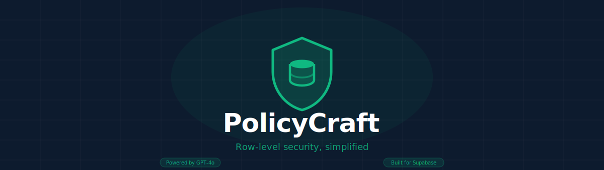
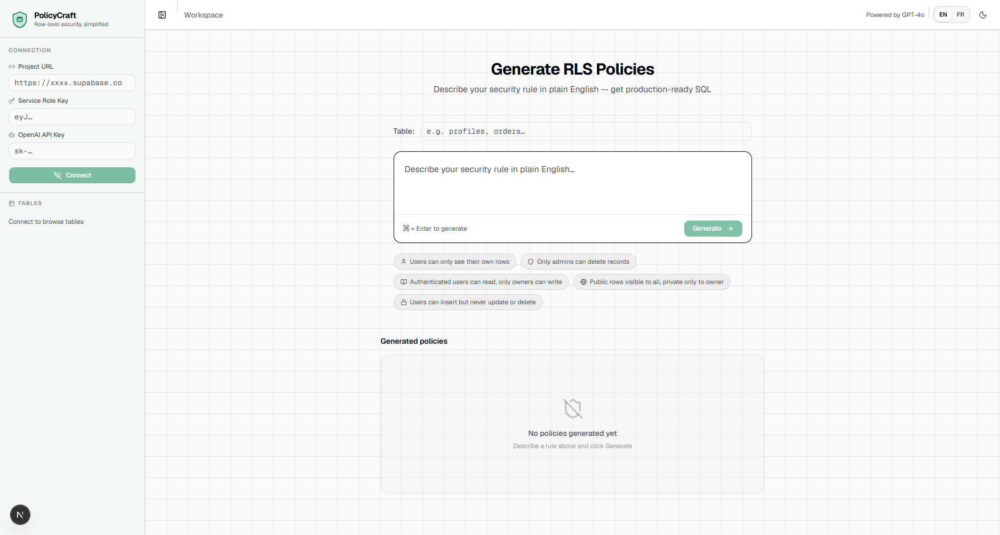
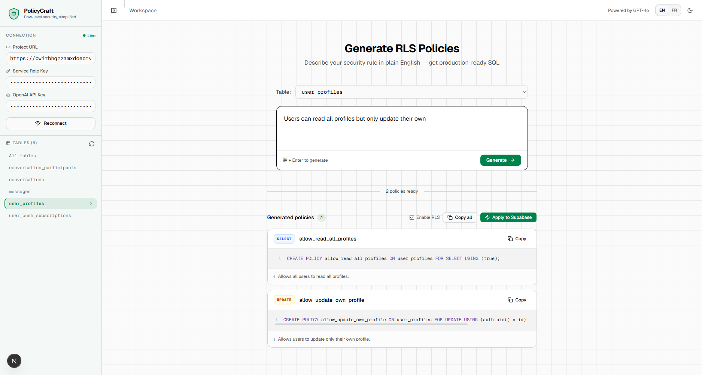

<div align="center">
  
  <br/>
  <br/>

  [](https://www.npmjs.com/package/policycraft)
  [](./LICENSE)
  [](https://openai.com)
  [](https://supabase.com)

  <p>
    Describe your security rules in plain English.<br/>
    Get production-ready Supabase RLS SQL instantly.
  </p>
</div>

---

## What is PolicyCraft?

PolicyCraft is a local dev tool that converts natural language into Supabase [Row Level Security (RLS)](https://supabase.com/docs/guides/auth/row-level-security) policies using GPT-4o. Run it inside any Supabase project, connect to your database, and generate policies like:

> _"Users can only see messages from conversations they are a participant of"_

…and get back complete, validated `CREATE POLICY` SQL — ready to apply in one click.

---

## Screenshots

<table>
  <tr>
    <td align="center">
      
      <sub>Connect your project and browse your tables</sub>
    </td>
    <td align="center">
      
      <sub>Describe a rule, get production-ready SQL</sub>
    </td>
  </tr>
</table>

---

## Installation

### Option 1 — npx (no install required)

```bash
# Run directly inside your Supabase project directory
npx policycraft init
```

### Option 2 — install as a dev dependency

```bash
npm install --save-dev policycraft
# or
pnpm add -D policycraft
```

---

## Usage

### 1. `init` — set up PolicyCraft in your project

Run this once from the root of your Supabase project:

```bash
npx policycraft init
```

This command will:
- Detect your `.env.local` or `.env` and validate the required keys
- Print a checklist of what is found / missing
- Add a `policycraft` script to your `package.json` so you can launch with `npm run policycraft`

**Example output:**

```
  PolicyCraft — setup

  › Found .env.local
  ✓ SUPABASE_URL          found
  ✓ SERVICE_ROLE_KEY      found
  ✓ OPENAI_API_KEY        found
  ✓ Added npm run policycraft script to package.json

  Ready! Launch with:

    npx policycraft start
```

---

### 2. `start` — launch the UI

```bash
npx policycraft start
```

Or, after running `init`:

```bash
npm run policycraft
```

The UI opens automatically at **http://localhost:3030**.

**Options:**

```bash
npx policycraft start --port 4000    # custom port
npx policycraft start --no-open      # skip opening the browser
```

---

## Environment Variables

PolicyCraft reads credentials from your project's `.env.local` (or `.env`). No manual copy-paste needed.

| Variable | Description |
|---|---|
| `NEXT_PUBLIC_SUPABASE_URL` | Your Supabase project URL (`https://xxxx.supabase.co`) |
| `SUPABASE_SERVICE_ROLE_KEY` | Service role key — found in **Settings → API** |
| `OPENAI_API_KEY` | Your OpenAI API key (`sk-...`) |

> `SUPABASE_URL` is also accepted as an alias for `NEXT_PUBLIC_SUPABASE_URL`.

If any key is missing, `policycraft init` will tell you exactly which ones and where to get them.

---

## How it works

```
Your project .env.local
        │
        ▼
policycraft start
        │
        ├── Reads credentials from cwd
        ├── Starts local Next.js server
        └── Opens browser at localhost:3030
                │
                ├── Connects to your Supabase project
                │     └── Lists tables via PostgREST OpenAPI spec
                │
                ├── You describe a rule in plain English
                │
                ├── GPT-4o generates CREATE POLICY SQL
                │
                └── One click to apply — or copy to your migration
```

### Security model

- Your **service role key** and **OpenAI key** are never sent to any third party other than Supabase and OpenAI.
- The server runs **locally only** — nothing is exposed to the internet.
- Keys are read from your local `.env.local` and injected as server-side environment variables; they are never included in the client JS bundle.

---

## Generated policy example

**Rule:** `Users can only see messages from conversations they are a participant of`

```sql
-- SELECT policy
CREATE POLICY "users_see_own_conversation_messages"
ON public.messages
AS PERMISSIVE FOR SELECT
TO authenticated
USING (
  conversation_id IN (
    SELECT conversation_id
    FROM public.conversation_participants
    WHERE user_id = auth.uid()
  )
);

-- INSERT policy
CREATE POLICY "users_insert_own_conversation_messages"
ON public.messages
AS PERMISSIVE FOR INSERT
TO authenticated
WITH CHECK (
  conversation_id IN (
    SELECT conversation_id
    FROM public.conversation_participants
    WHERE user_id = auth.uid()
  )
);
```

---

## Tech stack

| Layer | Technology |
|---|---|
| UI framework | Next.js 16 (App Router) |
| Components | shadcn/ui + Tailwind CSS v4 |
| Animations | motion/react (Framer Motion v12) |
| Icons | lucide-react |
| AI | OpenAI GPT-4o |
| Database | Supabase (PostgREST + pg_policies) |
| Theming | next-themes (light / dark) |
| i18n | Built-in EN / FR |

---

## Development

```bash
git clone https://github.com/your-username/policycraft
cd policycraft
npm install
npm run dev        # starts at localhost:3001
```

To build the distributable package:

```bash
npm run pack:prepare   # next build + copies static assets into .next/standalone
npm pack               # creates policycraft-x.x.x.tgz to test locally
npm publish            # publish to npm
```

---

## License

MIT © 2026
